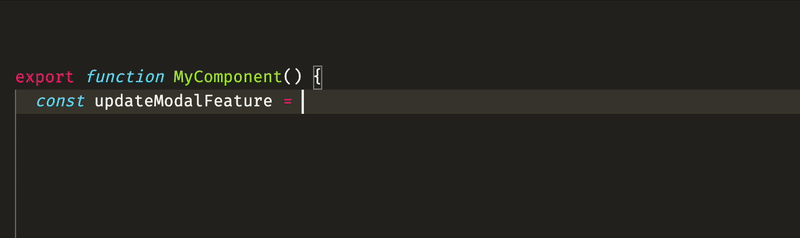

# Unrevealed CLI

## Introduction

The Unrevealed CLI is a code generation tool designed to simplify the integration of [Unrevealed](https://unrevealed.tech) into your codebase. Using the CLI will allow you to automaticaly type the SDKs. This has multiple benefits:

- **Autocomplete:** Don't open Unrevealed every time you need to know the key of a feature
- **Validation:** Never make typos anymore, or forget to pass the right attributes of your users and teams
- **Maintenance:** Easily clean up your features by archiving them on Unrevealed then running the CLI to remove them from your codebase



## Getting started

Install the CLI. We recommend adding is as a `devDependency` of your project. If you have a monorepo, we also recommend installing it at the root if you're using it in multiple applications.

```
npm install -D unrev
```

## Usage

1. Login to Unrevealed

```
unrev login
```

2. Initialize your config

```
unrev init
```

This will ask you a few questions and generate `unrevealed.config.json` at the root of your project.

3. Generate

```
unrev generate
```

This command will generate types for the target SDKs, based on `unrevealed.config.json`

## `unrevealed.config.json`

The unrevealed config file is used by the CLI and the [VS Code extension](https://marketplace.visualstudio.com/items?itemName=unrevealed.unrevealed-vscode) to generate code and give you context about your features. Here's an example of config file:

```
{
  "productId": "YOUR_PRODUCT_ID",
  "generates": {
    "apps/webapp/src/generated/unrevealed.ts": {
      "sdk": "react"
    },
    "apps/api/src/generated/unrevealed.ts": {
      "sdk": "node"
    }
  }
}
```
